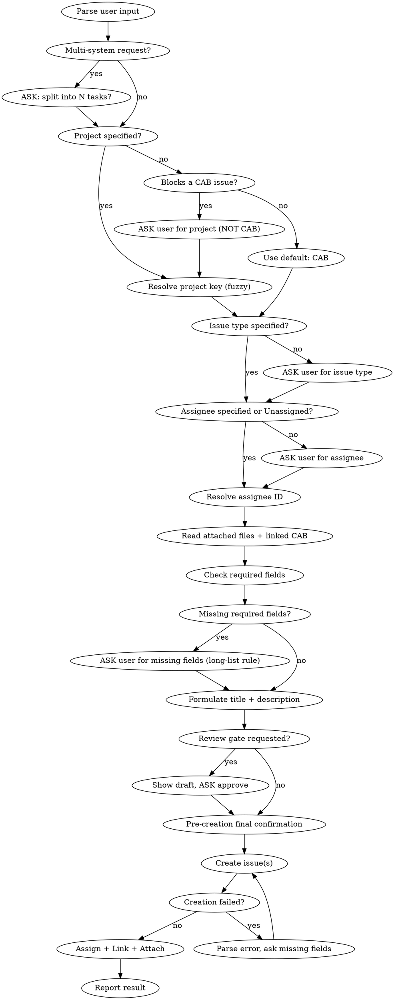

# Jira Task Creation

Create a well-structured Jira issue from free-form user input using MCP tools.

## Critical Rules

- **AskUserQuestion tool**: ALWAYS use the `AskUserQuestion` tool when asking the user for input (issue type, field values, assignee clarification, etc.). NEVER ask questions as plain text output.
- **Batch size**: Do NOT batch more than 2-3 critical questions in a single `AskUserQuestion`. Users routinely overlook the 3rd–4th item, especially multi-select fields. Prefer focused 1–2 question rounds. After every batch, **verify all answers were returned** — re-ask any that came back empty before proceeding.
- **Parallel calls**: Maximize parallel API calls. Bootstrap (cloudId, assignee lookup, issue types, linked CAB issue) runs in parallel. When creating multiple issues, create them in parallel. Post-creation steps (assign, link, attach) also run in parallel.
- **Description rendering gotcha**: Jira renders the `description` field as **Wiki markup**, not Markdown. `## Heading` becomes `h2.`, `**bold**` becomes `*bold*`, code spans become `{{...}}`. Headers, bullets, ordered lists, bold and code spans render fine. **Do NOT use Markdown tables** in the description — they will not render. Use bullet lists with bold labels instead.

## Workflow



## Environment Setup

**CloudId** is required for `claude_ai_Atlassian` tools. Resolve it once per session:

```
mcp__claude_ai_Atlassian__getAccessibleAtlassianResources()
```

Extract `id` from response. Cache it for subsequent calls in the same session.

**Parallel bootstrap:** Call these in parallel on first invocation:
1. `getAccessibleAtlassianResources()` — cloudId
2. `lookupJiraAccountId(cloudId: "detmir.atlassian.net", searchString: ...)` — assignee (use site URL as cloudId before real cloudId is resolved)
3. `getJiraProjectIssueTypesMetadata(cloudId: "detmir.atlassian.net", projectIdOrKey: ...)` — issue types
4. `getJiraIssue(cloudId: "detmir.atlassian.net", issueIdOrKey: <linked CAB key>, fields: ["summary", "issuetype", "project"])` — context for any referenced/linked CAB issue. Use the summary as a hint for default values (e.g. Беклог) and to verify the link target exists.

## Steps

### 1. Parse Input

Extract from user message:
- **Project key** (e.g. "в проекте PROJ", "project: DEV"). Default: `CAB`, НО: если задача блокирует/связана с CAB-issue, то её нельзя создавать в CAB (CAB-задача не может блокировать другую CAB-задачу). В таком случае ASK пользователя о проекте через `AskUserQuestion` и не предлагать CAB как опцию.
- **Issue type** (e.g. "change request", "defect", "баг", "задача"). No default — ASK if missing.
- **Assignee** (name or email). No default — ASK if missing. **Recognize "no-assignee" intent**: phrases like `без исполнителя`, `не назначать`, `unassigned`, `nobody`, `пусто`, `оставить пустым` mean **assignee = None**. Do NOT ask for a name in this case — record "Unassigned" and skip assignment in step 9.
- **File paths** — any local files or images the user referenced or attached.
- **Issue links** — e.g. "блокирует CAB-10072", "relates to OPER-123". Extract link type and target issue key.
- **Everything else** — raw material for title and description.

#### 1a. Multi-task split detector

If the user's request describes work touching **2+ distinct systems / projects / layers** (e.g. ERP+EWM, frontend+backend, web+mobile, API+UI, multiple integrations), ASK via `AskUserQuestion` whether to split into N separate tasks **BEFORE drafting any description**. In well-known pairs (ERP↔EWM, web↔mobile, API↔UI) split is the recommended default — surface it as the first option.

Pick the signal up from explicit lists ("в ERP и в EWM", "и фронт, и бэк") or descriptions where each subsystem has its own deliverable.

If the user already split the request explicitly (e.g. "создай две задачи: одну в OPER, другую в EWM"), skip the question and proceed with N tasks.

#### 1b. Project key fuzzy resolution

If the user references a project by name/alias rather than a clean KEY:
- Common aliases: `склад / WMS / складские приложения → EWM`, `ОД / операционные приложения → OPER`.
- Fallback: call `mcp__mcp-atlassian__jira_get_all_projects` and fuzzy-match by `name`. If 1 strong match — use it. If multiple — ASK with shortlist.
- Always echo the resolved KEY back in the pre-creation final confirmation (step 6b).

### 2. Resolve Assignee

If assignee = "Unassigned" (per step 1) — skip this step; the issue stays unassigned after creation.

Otherwise, use `mcp__claude_ai_Atlassian__lookupJiraAccountId` — it handles Cyrillic names and returns `accountId`.

```
mcp__claude_ai_Atlassian__lookupJiraAccountId(
  cloudId: <cloudId>,
  searchString: "<name or email>"
)
```

Save both the `accountId` AND the `email` from the response — you'll need the email for assignment.

**Assignee assignment gotcha:** `mcp__mcp-atlassian__jira_create_issue` does NOT reliably accept `accountId` as assignee. Instead:
1. Create the issue WITHOUT assignee.
2. After creation, use `mcp__mcp-atlassian__jira_update_issue` with the user's **email** to assign:
   ```
   jira_update_issue(issue_key: "OPER-123", fields: '{"assignee": "user@detmir.ru"}')
   ```

**Do NOT use** `jira_get_user_profile` for Cyrillic names — it will fail.

### 3. Get Issue Types for Project

Issue types vary per project. Always fetch them:

```
mcp__claude_ai_Atlassian__getJiraProjectIssueTypesMetadata(
  cloudId: <cloudId>,
  projectIdOrKey: "<project_key>"
)
```

Use the `name` field to match user's input. Save the `id` — needed for required fields check.

### 4. Check Required Fields

**Important**: The metadata API may not report ALL required fields. Treat it as a first pass, and handle creation errors as a fallback (see Error Handling).

```
mcp__claude_ai_Atlassian__getJiraIssueTypeMetaWithFields(
  cloudId: <cloudId>,
  projectIdOrKey: "<project_key>",
  issueTypeId: "<issue_type_id>",
  maxResults: 50
)
```

Parse `required: true` fields. For each required field not provided by the user:
1. Use `mcp__mcp-atlassian__jira_search_fields` to find field ID by name.
2. Use `mcp__mcp-atlassian__jira_get_field_options` to get allowed values (or use `allowedValues` directly from the metadata response).
3. ASK the user to choose a value (apply long-list rule below if needed).

#### 4a. Long-list field rule (>4 allowed values)

`AskUserQuestion` accepts a maximum of 4 options per question. For fields with more allowed values (Беклог has 13, "Объект блокировки" has 15+, Подразделение заказчика, etc.):

1. **List the full set** of allowed values in the question text itself, comma-separated. The user MUST see all options.
2. In `options`, put **up to 4 most-likely candidates** ranked by context (linked CAB summary, project, file content, system area). Mark the top one with `(Recommended)`.
3. Rely on the built-in **"Other"** option for free-text input when the user wants something outside the shortlist.
4. Never silently pre-filter beyond presenting the 4 quick picks — the full list MUST stay visible in the question text.

#### 4b. Fuzzy-match free-text answers to allowedValues

When the user types a value via "Other" (or in plain text), match it case-insensitively against `allowedValues`:
- **Exact match** → use as-is.
- **Unique prefix or substring match** (e.g. user types `Маркетплей`, only `Маркетплейс` matches) → use silently and mention the resolved value in the final confirmation (step 6b).
- **2+ matches** → ASK which one via `AskUserQuestion` shortlist.
- **No match** → ASK user to pick from the full list (long-list rule above).

#### 4c. Field inheritance for split tasks

When creating multiple related tasks split from one user request (see step 1a), **inherit common field values by default**:
- Беклог, Component, Priority, Подразделение заказчика, Заказчик, Номер CAB, link target — all default to the same value across the split tasks.
- Ask **once**, with explicit phrasing: "Беклог для обеих задач?" / "...для всех задач?".
- Only diverge per-task when the user says so or when the field is project-specific (different `allowedValues`).

**Field format by type:**
- **Select (dropdown)**: `{"value": "Option Name"}`
- **Multi-select**: `[{"value": "Option1"}, {"value": "Option2"}]`
- **Cascading select**: `{"value": "Parent", "child": {"value": "Child"}}`
- **User picker**: `{"accountId": "..."}`
- **Date**: `"YYYY-MM-DD"`
- **Text**: `"plain string"`

### 5. Read Attached Files

If the user provided files (screenshots, documents, spreadsheets, etc.), **read their content BEFORE formulating title and description**. File content provides crucial context — field names, report layouts, error messages, data examples, etc. Use the Read tool for each file. Incorporate key details from files into the description.

### 6. Formulate Title and Description

**Title (summary):**
- Concise, actionable phrase (5-15 words).
- Start with a verb or noun describing the outcome.
- No project prefix, no issue type prefix.
- Language: match the user's language.

**Description (Wiki-rendered, drafted in Markdown):**
- Structure the user's information into clear sections.
- Use headers, bullet points, code blocks as appropriate.
- **Do NOT use Markdown tables** — Jira renders descriptions as Wiki markup and tables won't render. Use bullet lists with bold labels instead.
- Preserve all technical details from the user's input.
- If user provided context/background — include it.
- Language: match the user's language.

### 6a. Description Review Gate (conditional)

Triggered when the user asks for explicit approval before creation: phrases like `согласуй`, `покажи описание`, `проверь описание`, `coordinate before`, `review before create`, `перед созданием согласуй`.

Action:
1. Render the draft summary + description (and, for split tasks, all of them) as plain text in your reply.
2. Use `AskUserQuestion` with options: `Принимаю как есть` / `Нужны правки` (and rely on built-in `Other` for inline edits).
3. If "Нужны правки" — collect them, revise, repeat the gate. Loop until approved.

When NOT triggered, skip this step and go directly to 6b.

### 6b. Pre-creation Final Confirmation

Before calling `jira_create_issue`, show **one** consolidated summary of every parameter that will be sent — even when no review gate was requested. Format:

For each task to be created, list:
- Project / Issue type / Summary / Assignee / Required custom fields (Беклог, Номер CAB, etc.) / Issue links / Attachments

Use a **Markdown table** when ≥2 tasks (this is in the chat reply, not in the Jira description, so tables are fine here). Then `AskUserQuestion`: `Создаём` / `Изменить параметры`.

Skip this step **only** when the user explicitly opted out (e.g. "создавай без подтверждения", "create without confirm").

### 7. Create Issue

Create WITHOUT assignee — assign separately after creation (see step 2).

```
mcp__mcp-atlassian__jira_create_issue(
  project_key: <project>,
  summary: <title>,
  issue_type: <type name>,
  description: <description in Markdown>,
  additional_fields: <JSON string of custom fields>
)
```

**Multiple issues:** When creating 2+ issues, call `jira_create_issue` in parallel.

### 8. Handle Creation Errors (Retry)

If creation fails with "Заполните поле X, Y, Z":
1. Parse field names from the error message.
2. Use `jira_search_fields` to find their field IDs.
3. Use `jira_get_field_options` to get allowed values (apply long-list rule from step 4a if needed).
4. ASK the user for values.
5. Retry creation with all fields.

This is expected — the metadata API does not always report all required fields.

### 9. Post-Creation: Assign + Attach + Link (in parallel)

After successful creation, run ALL post-creation steps in parallel:

**Assign** — skip when assignee was "Unassigned" (per step 1). Otherwise (use email, not accountId):
```
mcp__mcp-atlassian__jira_update_issue(
  issue_key: <created issue key>,
  fields: '{"assignee": "<email>"}'
)
```

**Attach files** (if user provided file paths):
```
mcp__mcp-atlassian__jira_update_issue(
  issue_key: <created issue key>,
  fields: "{}",
  attachments: "<comma-separated file paths>"
)
```

**Create issue links** (if user specified links):
```
mcp__mcp-atlassian__jira_create_issue_link(
  link_type: "Blocks",
  inward_issue_key: <created issue key>,
  outward_issue_key: <target issue key>
)
```

**Common link types:**
- `"Blocks"` — "блокирует", "blocks"
- `"Relates"` — "связано с", "relates to"
- `"Duplicate"` — "дубликат", "duplicate"

**For multiple related issues:** When the same source file applies to all of them, attach to each. Run all assign/link/attach calls for ALL issues in a single parallel batch.

### 10. Report Result

For a **single issue**, list:
- Issue key with link (e.g. [CAB-123](https://detmir.atlassian.net/browse/CAB-123))
- Title as created
- Issue type
- Assignee
- Values of custom required fields that were set
- Issue links (if any)
- Attachments (if any)

For **2+ issues**, render a **Markdown table** with one column per issue and rows for: Key (with link), Summary, Type, Assignee, Беклог, Номер CAB, Blocks/Relates, Attachments. Easier to scan than parallel bullets.

## Error Handling

- **"Заполните поле X"**: Parse missing field names → search fields → get options → ask user → retry. This is the primary error handling path — always expect it.
- **Assignee not found**: Ask user to clarify (provide email or full name). If user replies "без исполнителя" — accept as Unassigned and skip assignment.
- **Unknown issue type**: Show available types from `getJiraProjectIssueTypesMetadata`.
- **Attachment failed**: Report which files failed. The issue is already created — provide the key so user can attach manually.
- **Permission denied**: Report to user, suggest checking project access.
- **AskUserQuestion answers missing for batched questions**: Re-ask any unanswered question in a focused 1-question call before proceeding.

## Known Project Patterns

### Project OPER (Отдел операционных приложений)
- Required field **«Номер CAB»** (`customfield_10365`, text) — fill with the linked CAB issue key when available.
- Issue types: Business task, Internal task, Bug, ОПЭ, Проектное решение.
- Always requires **Беклог** (`customfield_10362`, multi-select).

### Project EWM (Отдел складских приложений)
- Same required fields as OPER: **Беклог** (`customfield_10362`, multi-select), **Номер CAB** (`customfield_10365`, text).
- Issue types: Business task, Internal task, Bug, ОПЭ, Проектное решение.
- Typical pair-target for OPER tasks that touch warehouse/EWM functionality (canonical split pair: ERP→OPER + EWM→EWM).

### Project CAB
- Issue types: Change Request, Defect, Project.
- Always requires **Беклог**, **Подразделение заказчика** (`customfield_10324`, select), **Заказчик** (`customfield_10363`, cascading select).
- **Заказчик** is a cascading select: parent = department name, child = person name (e.g. `{"value": "Коммерческая дирекция ТНП", "child": {"value": "Какуркина Эльвира Курбановна"}}`).

### Беклог allowed values (shared by OPER / EWM / CAB)
`BackOffice, CHEAP, E-com Цифровые сервисы, ГИС, ДИТ 2,5, ДЛ + TMS+СИ + ДУТЗ, ОД+Зоо, ФД КБ, HR, Lassie, Маркетинг, Маркетплейс, Коммерция` — 13 values, multi-select. Apply long-list rule (step 4a) when asking.

## What NOT to Do

- Do NOT ask questions as plain text — ALWAYS use the `AskUserQuestion` tool.
- Do NOT batch >2-3 critical questions in one `AskUserQuestion` call — users miss multi-select items in dense batches. Verify all answers are returned; re-ask any that came back empty.
- Do NOT pass `accountId` as assignee to `jira_create_issue` — it silently fails. Use email via `jira_update_issue` after creation.
- Do NOT use `jira_get_user_profile` for Cyrillic names — it will fail.
- Do NOT rely solely on metadata for required fields — always handle creation errors.
- Do NOT guess the assignee — always resolve via `lookupJiraAccountId`. **Exception:** when the user explicitly says "без исполнителя" / "unassigned", record assignee=None and skip assignment.
- Do NOT skip asking for missing required fields.
- Do NOT assume issue type from context — if the user didn't say it, ask.
- Do NOT hardcode issue type names — they vary per project (e.g. CAB uses "Change Request" and "Defect", not "Task" and "Bug").
- Do NOT run API calls sequentially when they can be parallelized.
- Do NOT draft a single description when the request clearly spans multiple systems — ask about split FIRST (step 1a).
- Do NOT skip the pre-creation final confirmation (step 6b) unless the user explicitly opted out.
- Do NOT use Markdown tables in the `description` field — Jira renders Wiki, tables won't render. (Tables in the chat reply for the final confirmation/report are fine.)
