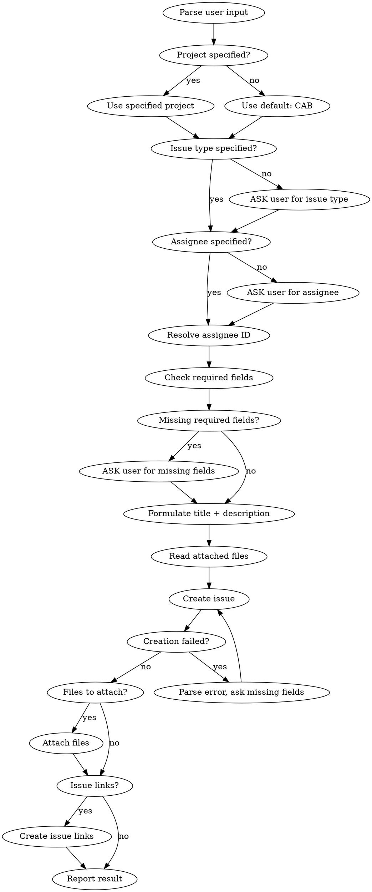

# Jira Task Creation

Create a well-structured Jira issue from free-form user input using MCP tools.

## Workflow



## Environment Setup

**CloudId** is required for `claude_ai_Atlassian` tools. Resolve it once per session:

```
mcp__claude_ai_Atlassian__getAccessibleAtlassianResources()
```

Extract `id` from response. Cache it for subsequent calls in the same session.

## Steps

### 1. Parse Input

Extract from user message:
- **Project key** (e.g. "в проекте PROJ", "project: DEV"). Default: `CAB`
- **Issue type** (e.g. "change request", "defect", "баг", "задача"). No default — ASK if missing
- **Assignee** (name or email). No default — ASK if missing
- **File paths** — any local files or images the user referenced or attached
- **Issue links** — e.g. "блокирует CAB-10072", "relates to OPER-123". Extract link type and target issue key
- **Everything else** — raw material for title and description

### 2. Resolve Assignee

Use `mcp__claude_ai_Atlassian__lookupJiraAccountId` — it handles Cyrillic names and returns `accountId`.

```
mcp__claude_ai_Atlassian__lookupJiraAccountId(
  cloudId: <cloudId>,
  searchString: "<name or email>"
)
```

Pass the returned `accountId` to the `assignee` parameter when creating the issue.

**Do NOT use** `mcp__mcp-atlassian__jira_get_user_profile` — it fails with Cyrillic names.

### 3. Get Issue Types for Project

Issue types vary per project. Always fetch them:

```
mcp__claude_ai_Atlassian__getJiraProjectIssueTypesMetadata(
  cloudId: <cloudId>,
  projectIdOrKey: "<project_key>"
)
```

Use the `name` field to match user's input. Save the `id` — needed for required fields check.

### 4. Check Required Fields

**Important**: The metadata API may not report ALL required fields. Treat it as a first pass, and handle creation errors as a fallback (see Error Handling).

```
mcp__claude_ai_Atlassian__getJiraIssueTypeMetaWithFields(
  cloudId: <cloudId>,
  projectIdOrKey: "<project_key>",
  issueTypeId: "<issue_type_id>",
  maxResults: 50
)
```

Parse `required: true` fields. For each required field not provided by the user:
1. Use `mcp__mcp-atlassian__jira_search_fields` to find field ID by name
2. Use `mcp__mcp-atlassian__jira_get_field_options` to get allowed values
3. ASK the user to choose a value

**Беклог field rule:** If the issue type has a "Беклог" field (select or multi-select), always present the **complete list** of allowed values from the metadata response (`allowedValues`) as options when asking the user. Do NOT pre-filter or guess — show every option so the user can pick.

**Field format by type:**
- **Select (dropdown)**: `{"value": "Option Name"}`
- **Multi-select**: `[{"value": "Option1"}, {"value": "Option2"}]`
- **Cascading select**: `{"value": "Parent", "child": {"value": "Child"}}`
- **User picker**: `{"accountId": "..."}`
- **Date**: `"YYYY-MM-DD"`
- **Text**: `"plain string"`

### 5. Read Attached Files

If the user provided files (screenshots, documents, spreadsheets, etc.), **read their content BEFORE formulating title and description**. File content provides crucial context for understanding the task — field names, report layouts, error messages, data examples, etc. Use the Read tool for each file. Incorporate key details from files into the description.

### 6. Formulate Title and Description

**Title (summary):**
- Concise, actionable phrase (5-15 words)
- Start with a verb or noun describing the outcome
- No project prefix, no issue type prefix
- Language: match the user's language

**Description (Markdown):**
- Structure the user's information into clear sections
- Use headers, bullet points, code blocks as appropriate
- Preserve all technical details from the user's input
- If user provided context/background — include it
- Language: match the user's language

### 7. Create Issue

```
mcp__mcp-atlassian__jira_create_issue(
  project_key: <project>,
  summary: <title>,
  issue_type: <type name>,
  assignee: <accountId>,
  description: <description in Markdown>,
  additional_fields: <JSON string of custom fields>
)
```

### 8. Handle Creation Errors (Retry)

If creation fails with "Заполните поле X, Y, Z":
1. Parse field names from the error message
2. Use `jira_search_fields` to find their field IDs
3. Use `jira_get_field_options` to get allowed values
4. ASK the user for values
5. Retry creation with all fields

This is expected — the metadata API does not always report all required fields.

### 9. Attach Files

If the user provided file paths, attach them AFTER issue creation:

```
mcp__mcp-atlassian__jira_update_issue(
  issue_key: <created issue key>,
  fields: "{}",
  attachments: "<comma-separated file paths>"
)
```

### 10. Create Issue Links

If the user specified issue links (e.g. "блокирует CAB-10072", "relates to OPER-123"):

```
mcp__mcp-atlassian__jira_create_issue_link(
  link_type: "Blocks",
  inward_issue_key: <created issue key>,
  outward_issue_key: <target issue key>
)
```

**Common link types:**
- `"Blocks"` — "блокирует", "blocks"
- `"Relates"` — "связано с", "relates to"
- `"Duplicate"` — "дубликат", "duplicate"

### 11. Report Result

Show the user:
- Issue key with link (e.g. [CAB-123](https://detmir.atlassian.net/browse/CAB-123))
- Title as created
- Issue type
- Assignee
- Values of custom required fields that were set

## Error Handling

- **"Заполните поле X"**: Parse missing field names → search fields → get options → ask user → retry. This is the primary error handling path — always expect it.
- **Assignee not found**: Ask user to clarify (provide email or full name).
- **Unknown issue type**: Show available types from `getJiraProjectIssueTypesMetadata`.
- **Attachment failed**: Report which files failed. The issue is already created — provide the key so user can attach manually.
- **Permission denied**: Report to user, suggest checking project access.

## Known Project Patterns

### Project OPER
- Has required field **«Номер CAB»** (`customfield_10365`, text) — fill with the linked CAB issue key if available
- Uses issue types: Business task, Internal task, Bug, ОПЭ
- Always requires **Беклог** (`customfield_10362`, multi-select)

### Project CAB
- Uses issue types: Change Request, Defect, Project
- Always requires **Беклог**, **Подразделение заказчика** (`customfield_10324`, select), **Заказчик** (`customfield_10363`, cascading select)
- **Заказчик** is a cascading select: parent = department name, child = person name (e.g. `{"value": "Коммерческая дирекция ТНП", "child": {"value": "Какуркина Эльвира Курбановна"}}`)

## What NOT to Do

- Do NOT use `jira_get_user_profile` for Cyrillic names — it will fail.
- Do NOT rely solely on metadata for required fields — always handle creation errors.
- Do NOT guess the assignee — always resolve via `lookupJiraAccountId`.
- Do NOT skip asking for missing required fields.
- Do NOT assume issue type from context — if the user didn't say it, ask.
- Do NOT hardcode issue type names — they vary per project (e.g. CAB uses "Change Request" and "Defect", not "Task" and "Bug").
