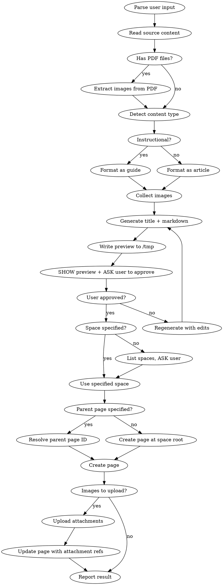

# Send to Confluence

Create a Confluence article from files or text input. Detects instructional content and formats accordingly. Shows preview before publishing.

## Workflow



## Environment Setup

**CloudId** is required for `claude_ai_Atlassian` tools. Resolve once per session:

```
mcp__claude_ai_Atlassian__getAccessibleAtlassianResources()
```

Extract `id` from response. Cache for subsequent calls.

## Steps

### 1. Parse Input

Extract from user message:
- **File paths** — local files (.md, .txt, .docx, .pdf, images)
- **Raw text** — inline content in the message
- **Space key** — if mentioned (e.g. "в пространство DEV", "space: TEAM")
- **Parent page** — if mentioned (e.g. "под страницей X", "parent: Getting Started")

### 2. Read Source Content

Use `Read` tool on every provided file. For each file, note:
- **Text content** — for .md, .txt, .pdf files
- **Image files** — standalone .png, .jpg, .jpeg, .gif, .svg, .webp files
- **Image references** — in .md files: `` patterns

Build two lists:
- `content_sources[]` — all text content combined
- `image_files[]` — all image file paths (standalone + referenced in markdown)

### 2a. Extract Images from PDF

If any source file is a PDF, extract embedded images using `pdfimages`:

```bash
mkdir -p /tmp/confluence-pdf-images
pdfimages -png -j "<pdf_path>" /tmp/confluence-pdf-images/img
```

This extracts all images: JPEG files stay as `.jpg`, others are converted to `.png`.

**Filter out noise** — PDF files contain small icons, logos, and UI elements from email signatures, etc. Keep only meaningful images:

```bash
# List extracted files with sizes, keep only files > 5KB
find /tmp/confluence-pdf-images -type f \( -name "*.jpg" -o -name "*.png" \) -size +5k
```

Add the filtered images to `image_files[]`. Small images (< 5KB) are typically icons/logos and should be discarded.

**Naming:** When generating the article, reference extracted images by their filename (e.g. `img-008.jpg`). Add descriptive alt-text based on the PDF context (e.g. ``).

### 3. Detect Content Type

Scan combined content for instructional signals:

**Instructional indicators** (any 2+ triggers "guide" format):
- Keywords: "инструкция", "руководство", "как настроить", "шаги", "how to", "steps", "guide", "setup", "configure", "install", "process", "procedure"
- Structure: numbered lists with sequential actions
- Imperative mood: "нажмите", "откройте", "выполните", "click", "open", "run"

If not instructional — use general article format.

### 4. Generate Title + Markdown

**Title:**
- Concise, 5-12 words
- Descriptive, reflects the main topic
- Language: match the user's language

**Instructional format:**
```markdown
# [Title]

## Overview
Brief description of what this guide covers and who it's for.

## Prerequisites
- Requirement 1
- Requirement 2

## Steps

### Step 1. [Action name]
Description of what to do.

**Expected result:** What the user should see after this step.

### Step 2. [Action name]
...

## Troubleshooting
Common issues and how to resolve them.

## Related Links
- [Link 1](url)
```

**General article format:**
```markdown
# [Title]

## Overview
Brief summary of the topic.

## [Section 1]
Content...

## [Section 2]
Content...

## Summary
Key takeaways.
```

**Image references** — use `` format (filename only, no full path). Confluence markdown resolves filenames from page attachments.

### 5. Preview

1. Write the complete markdown to `/tmp/confluence-preview.md`
2. Show the user:
   - Generated **title**
   - The **full markdown content** inline
   - List of **images** that will be attached
3. **ASK for approval** before publishing
4. If user requests changes — regenerate and show again

**Do NOT proceed to publishing without explicit user approval.**

### 6. Resolve Space

If user specified a space key — use it directly.

Otherwise, fetch available spaces and ASK:

```
mcp__claude_ai_Atlassian__getConfluenceSpaces(
  cloudId: <cloudId>,
  limit: 50
)
```

Present space names and keys to the user. Let them pick.

### 7. Resolve Parent Page (optional)

Only if user specified a parent page. Search by title:

```
mcp__mcp-atlassian__confluence_search(
  query: "<parent page title>",
  spaces_filter: "<space_key>",
  limit: 5
)
```

Use the matching page's `id` as `parent_id`.

### 8. Create Page

```
mcp__mcp-atlassian__confluence_create_page(
  space_key: <space>,
  title: <title>,
  content: <markdown body>,
  parent_id: <parent_id or omit>,
  content_format: "markdown"
)
```

Extract `id` from response — needed for attachment upload.

### 9. Upload Images

If `image_files[]` is not empty:

**Single image:**
```
mcp__mcp-atlassian__confluence_upload_attachment(
  content_id: <page_id>,
  file_path: "<path>"
)
```

**Multiple images:**
```
mcp__mcp-atlassian__confluence_upload_attachments(
  content_id: <page_id>,
  file_paths: "<path1>,<path2>,..."
)
```

### 10. Update Page with Attachment References

After uploading, update the page to ensure image references use filenames only (not full local paths):

```
mcp__mcp-atlassian__confluence_update_page(
  page_id: <page_id>,
  title: <title>,
  content: <markdown with filename-only image refs>,
  content_format: "markdown",
  is_minor_edit: true,
  version_comment: "Attached images"
)
```

**Skip this step** if page content already uses filename-only references and no path replacement is needed.

### 11. Report Result

Show the user:
- Page title
- Direct link: `https://detmir.atlassian.net/wiki/spaces/<space_key>/pages/<page_id>`
- Space name
- Parent page (if set)
- Number of images uploaded

## Error Handling

| Error | Action |
|-------|--------|
| Space not found / no access | List available spaces, ASK user to pick |
| Parent page not found | Inform user, offer to create at space root |
| Title already exists in space | ASK user: rename, update existing page, or cancel |
| Image upload failed | Report which files failed. Page already created — provide link for manual upload |
| Page creation failed (permissions) | Report error, suggest checking space permissions |
| File not readable | Skip file, warn user, continue with remaining content |
| pdfimages not installed | Install via `brew install poppler`, or skip PDF image extraction and warn user |
| No images extracted from PDF | Normal for text-only PDFs — continue without images |

## What NOT to Do

- Do NOT publish without user approval — always show preview first
- Do NOT hardcode a space key — always resolve from user input or ask
- Do NOT skip image upload — if images are referenced, they must be uploaded as attachments
- Do NOT embed base64 images in content — Confluence does not support it
- Do NOT use `storage` or `wiki` content format — always use `markdown`
- Do NOT create the page before resolving space and getting approval
- Do NOT guess the parent page — if ambiguous, show search results and ask
